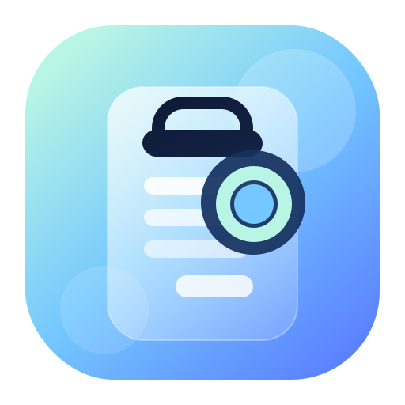
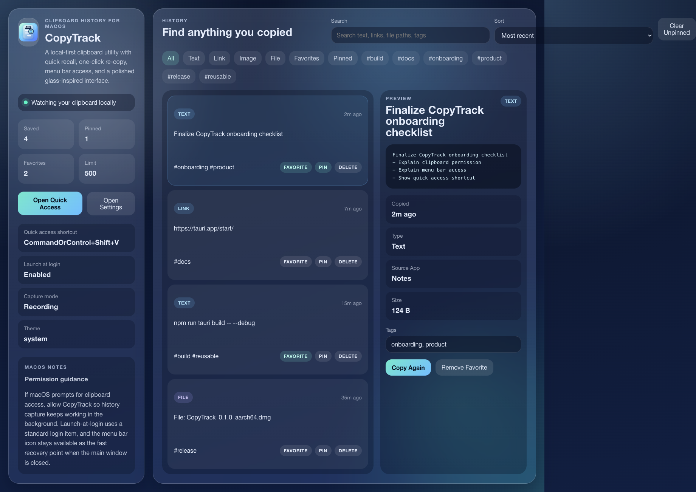
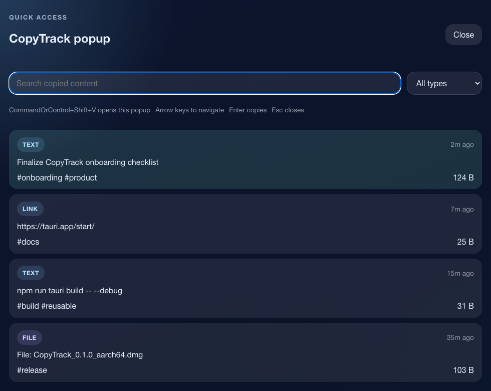
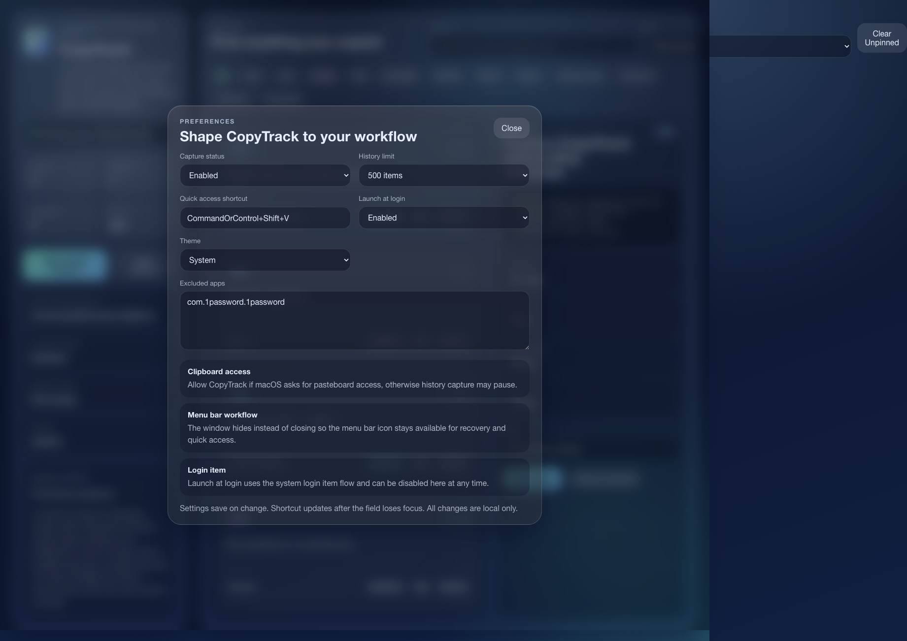

# CopyTrack

<p align="center">
  
</p>

<p align="center">
  Локальный менеджер истории буфера обмена для macOS с быстрым вызовом, menu bar-доступом и повторным копированием в один клик.
</p>

<p align="center">
  <a href="./README.md">English</a> · <strong>Русский</strong>
</p>



## Зачем нужен CopyTrack

CopyTrack сохраняет то, что ты копируешь, и позволяет быстро вернуть это обратно: текст, ссылки, изображения и ссылки на файлы. Вместо потери полезных фрагментов после следующего `Cmd + C` у тебя остается локальная история с поиском, тегами, закреплением и быстрым popup-окном.

Версия `0.1.0` ориентирована на `macOS-first` сценарий. Дальше проект можно расширять на Windows и Linux, но сейчас фокус на качественном desktop utility опыте.

## Что уже есть

- Локальная история буфера обмена
- Текст, ссылки, изображения и файловые элементы
- Повторное копирование из главного окна и quick access popup
- Редактируемая глобальная горячая клавиша
- Работа через menu bar и запуск при входе
- Избранное, закрепление, теги, фильтры и сортировка
- Импорт и экспорт в JSON
- Настраиваемый лимит истории: `50`, `100`, `500`, `1000`, `10000`
- Исключенные приложения для чувствительных сценариев
- Локальный поиск на базе SQLite `FTS5`
- Интерфейс на английском и русском языках

## Экраны

### Главное окно


### Быстрый доступ



### Настройки



## Быстрый старт

### Запуск из исходников

```bash
npm install
npm run tauri dev
```

### Проверка проекта

```bash
npm run check
cargo check --manifest-path src-tauri/Cargo.toml
```

### Сборка desktop-бандла

```bash
npm run tauri build
```

## Подсказки по использованию

- Горячая клавиша по умолчанию: `Cmd+Shift+V`
- Значок сверху показывает меню с последними элементами истории
- Клик по записи в истории сразу копирует ее обратно
- Чувствительные приложения лучше добавить в список исключений
- Если macOS спросит доступ к буферу, его нужно разрешить

## Документы проекта

- Архитектура: [ARCHITECTURE.md](./ARCHITECTURE.md)
- Релизный процесс: [RELEASE.md](./RELEASE.md)
- Следующие идеи: [NEXT.md](./NEXT.md)
- Draft по sync: [SYNC.md](./SYNC.md)
- Onboarding: [docs/ONBOARDING.md](./docs/ONBOARDING.md)
- QA checklist: [docs/QA.md](./docs/QA.md)
- Research по похожим приложениям: [RESEARCH.md](./RESEARCH.md)
